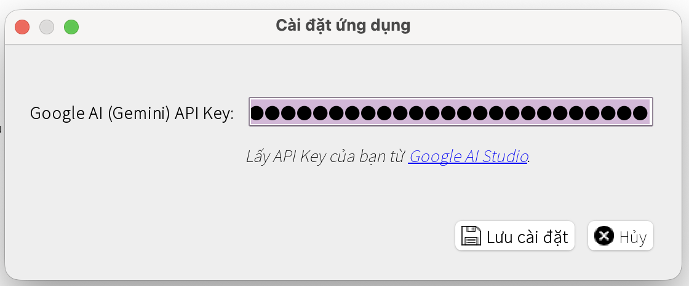
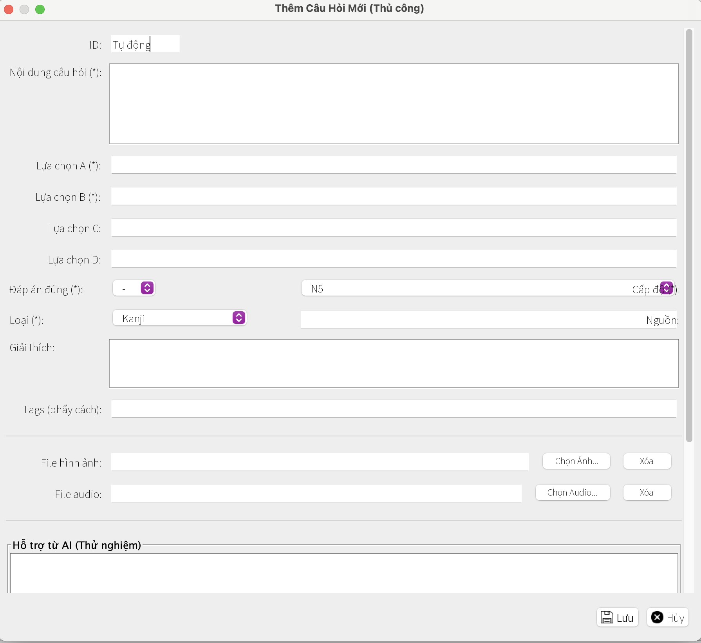
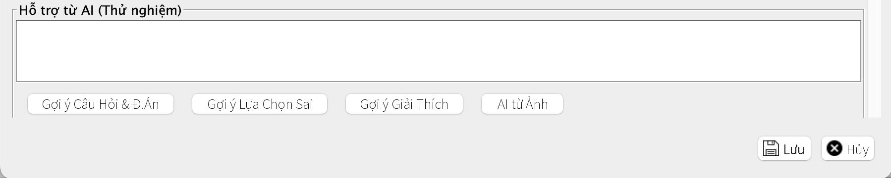

# 🏦 Exam Question Bank Management System

[](https://www.oracle.com/java/technologies/javase-jdk11-downloads.html)
[](https://www.mysql.com/)
[](https://maven.apache.org/)
[](https://opensource.org/licenses/MIT)

A powerful desktop application built on **Java Swing** and **MySQL**, designed to create an effective tool for managing, storing, and compiling multiple-choice exams for educators and content creators.

<br>


<br>

---

## 📜 Table of Contents

1.  [Project Overview](#-project-overview)
2.  [Key Features](#-key-features)
3.  [Technology & Architecture](#️-technology--architecture)
4.  [Getting Started](#-getting-started)
5.  [Usage Guide](#-usage-guide)
6.  [Future Improvements](#-future-improvements)
7.  [License](#-license)
8.  [Support the Project](#-support-the-project)
9.  [Contact](#-contact)

---

## 🌟 Project Overview

This project was developed to address a real-world need in the education sector: the necessity for a specialized, powerful, and user-friendly tool to digitize and manage question banks. The system helps minimize manual labor, automates processes, and provides intelligent features to enhance work efficiency.

Our platform is designed to serve the workflow of teachers and training managers:

*   **For Educators/Content Creators:** We provide an intuitive interface to create, categorize, and store questions. Advanced search and filtering tools make it easy to find and reuse content.
*   **For Administrators:** The system allows for the flexible creation and customization of exams from the existing question bank, which can then be exported into professional file formats for printing or online use.

To effectively connect these processes, we have integrated modern technologies such as **Artificial Intelligence (Google Gemini)** to automatically extract questions from images, speeding up the data entry and document digitization process.

---

## ✨ Key Features

📚 ### 1. Comprehensive Question Bank Management
*   Create, edit, delete, and view questions with an intuitive editor.
*   Multimedia Support: Attach **Audio** and **Image** files to questions.
*   Detailed Classification: Assign Levels (N1-N5), Question Types, Sources, and Tags to each question.

📝 ### 2. Exam Compilation and Management
*   Create new exams by dragging and dropping or selecting questions from the bank.
*   Arrange the order and customize the list of questions within each exam.
*   Store and manage all created exams.

🤖 ### 3. Artificial Intelligence Integration (AI-Powered by Gemini)
*   **Extract Questions from Images:** Upload an image of an exam page, and the AI will automatically analyze and convert it into structured questions within the system.
*   **Content Suggestions:** Provides suggestions for creating questions based on text or topics.

📄 ### 4. Professional File Export
*   Export exams and answer keys to **PDF** and **DOCX (Word)** formats.
*   **Automatic Exam Shuffling:** Generate multiple different versions of an exam from a single original with just one click.
*   Option to print with answer keys and detailed explanations.

🔍 ### 5. Advanced Search and Filtering
*   Quickly search for questions by keyword, level, type, and various other criteria.
*   Filter questions with or without attached multimedia files.

## ⚙️ Technology & Architecture

| Category | Technology / Library |
| :--- | :--- |
| **Platform & Language** | Java 11+, Java Swing |
| **Database** | MySQL 8.0+, JDBC |
| **Build Tool** | Apache Maven |
| **Logging** | SLF4J & Logback |
| **File Processing Libraries** | Apache PDFBox (PDF), Apache POI (DOCX) |
| **API & Networking** | OkHttp3, Gson, Google Gemini API |
| **Architecture** | Layered Architecture (UI, Service, DAO), Service-Oriented Design |

## 🚦 Getting Started

### Prerequisites

*   **JDK 11** or newer
*   **Apache Maven** 3.6+
*   **MySQL Server** 8.0+
*   An IDE like IntelliJ IDEA or Eclipse
*   **Google Gemini API Key**

### Installation Steps

1.  **Clone the Repository**
    ```bash
    git clone https://github.com/Chizk23/NGAN_HANG_DE_THI.git
    cd NGAN_HANG_DE_THI
    ```
2.  **Set up the Database**
    *   Open the `src/main/resources/config.properties` file and update the `db.user` and `db.password` for MySQL.
    *   Create the database in MySQL:
        ```sql
        CREATE DATABASE NGAN_HANG_DE_THI CHARACTER SET utf8mb4 COLLATE utf8mb4_unicode_ci;
        ```
    *   **For the first run:** Uncomment the line `DatabaseManager.initializeSchemaAndDatabase();` in the `MainApplication.java` file and run the application to automatically create the tables. Then, comment it out again.

3.  **Set up the API Key**
    *   Open the `src/main/resources/config.properties` file and add your API Key:
        ```properties
        ai.gemini.apikey=YOUR_GOOGLE_AI_STUDIO_API_KEY_HERE
        ```

4.  **Build and Run the Application**
    *   Use Maven to build:
        ```bash
        mvn clean install
        ```
    *   Run the generated JAR file in the `target/` directory:
        ```bash
        java -jar nganhangdethi-1.0.jar
        ```

---

## 📖 Usage Guide

#### Step 0: Configure API Key (Required for AI features)
Before use, go to `File` -> `Settings`, enter your API Key, and click `Save`.



---

### a) Question Management Functions

#### Add a new question
1.  Click the **"Add Question"** icon on the toolbar.
    

2.  A dialog will appear with two options:
    

**Option 1: Add a single question**
- Create a question manually or use the AI-assisted buttons to generate content, incorrect answers, explanations, or extract from a single image.




**Option 2: Add multiple questions from an image file**
- Upload an image, enter the expected number of questions, and click **"Extract with AI"**.
- After the AI processes the image, you can edit, select, and add the questions to the bank.


#### Other operations
- **Reload, Edit, Delete:** Use the buttons on the toolbar. Always click **"Reload"** after making changes to update the data.
- **View Details:** **Double-click** on a question to open the detailed information window.


---

### b) Exam Management

#### Add or Edit an Exam
- Click **"Create New Exam"** or select an exam and click **"Edit Exam"**.
- Use the arrow buttons to move questions between the bank and the exam, and to arrange their order.


#### Export an Exam File
- Select an exam and use the function buttons to export the file.
- **"Export Shuffled Exam Set"** will generate multiple randomized versions of the exam, each with its own answer key.


#### View Exam Details
- **Double-click** on an exam to open the details window. Here, you can further double-click on a question to view its information.


---

## 🔮 Future Improvements

*   🌐 **Web Version:** Develop a web-based version of the application.
*   🤖 **AI Upgrade:** Integrate an AI model to automatically generate questions from text.
*   📊 **Statistics & Analysis:** Build a dashboard to analyze question difficulty.
*   🔄 **Bulk Data Import/Export:** Allow importing/exporting questions from Excel/CSV files.
*   👥 **Collaboration Features:** Allow multiple users to work together on a single question bank.

## 📄 License

This project is licensed under the [MIT License](LICENSE).

## ⭐ Support the Project

If you find this project useful, please consider giving it a star ⭐ on GitHub!

## 📞 Contact

*   **Nguyễn Thanh Huyền** - [@Chizk23](https://github.com/Chizk23)